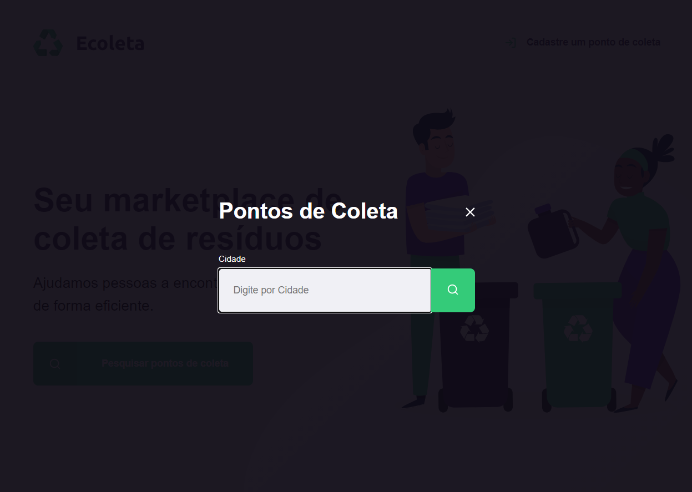

# Nlwi1
Next Level Week novice project 

Meu primeiro projeto auxíliado pela Rocketseat.

Primeira aula foi o ínicio e conclusão abaixo, começando com HTML, CSS e depois JAVAScript

O projeto utilizou diversas dependências usando npm install como express, sqlite3, nodemon e nunjucks (este instalado pelo vscode).
Uma página a parte para o cadastro dos pontos, no projeto também foi criado o proprio servidor e banco de dados.

Este é o efeito na mesma página inicial para a pesquisa, o projeto usou diversas ferramentes como 

Abaixo a página de resultados, que está bem anexada ao banco de dados do servidor que é incrementado pela página de cadastro.

Há também a questão de responsividade, onde é você adaptar tudo que fez para telas maiores ou menores que seu ambiente de desenvolvimento:

Acima a página inicial e abaixo a página de procura.

Certas partes de CSS ele deixou para que fizessemos sozinhos, embora não seja tão complicado depois que repete diversas vezes.

Com apoio das aulas é possível iniciar bem no conhecimento de desenvolvimento web, pretendo continuar aprendendo e postar aqui os resultados.

